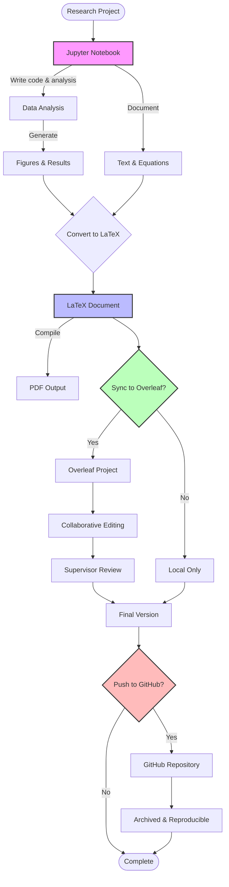
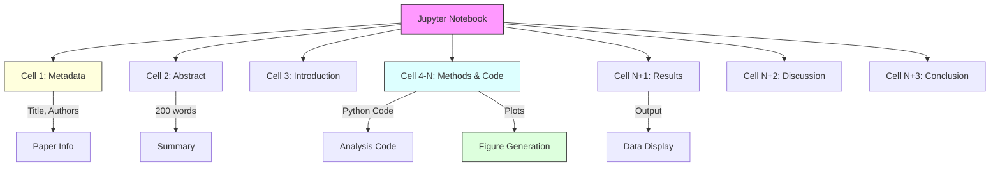
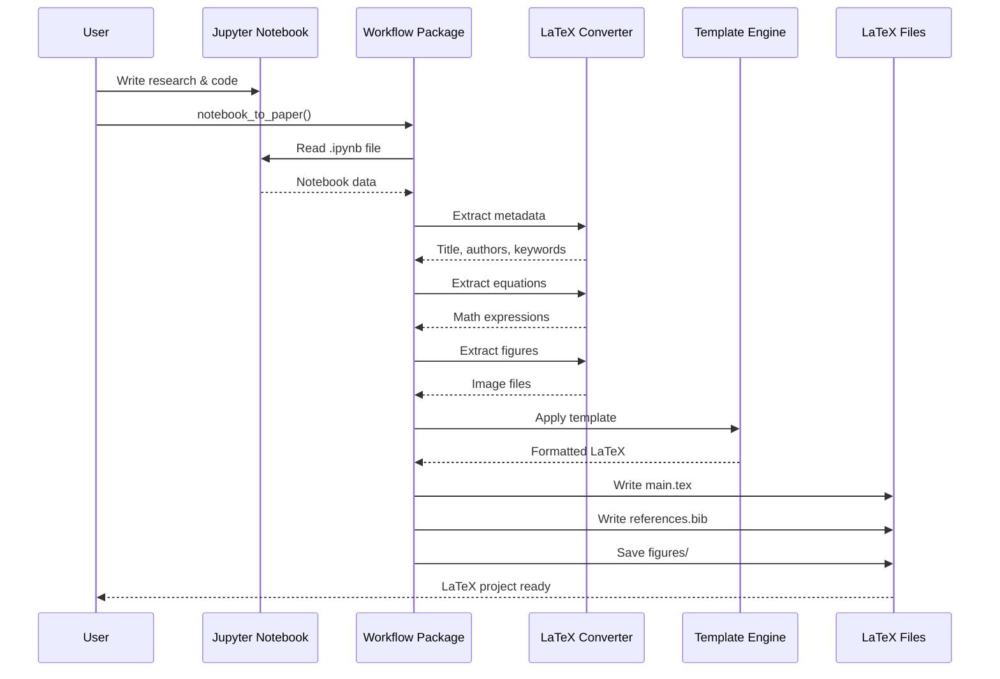
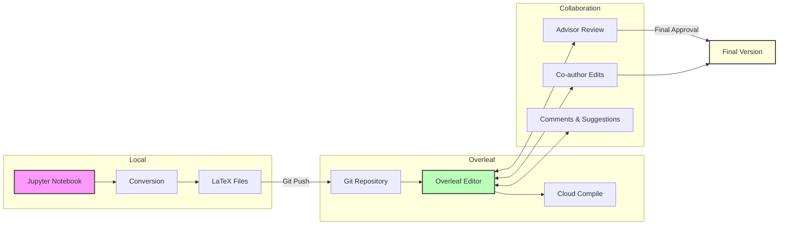
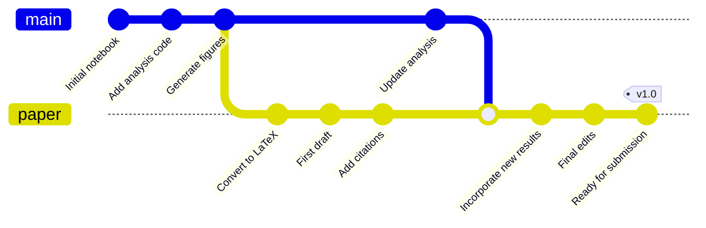
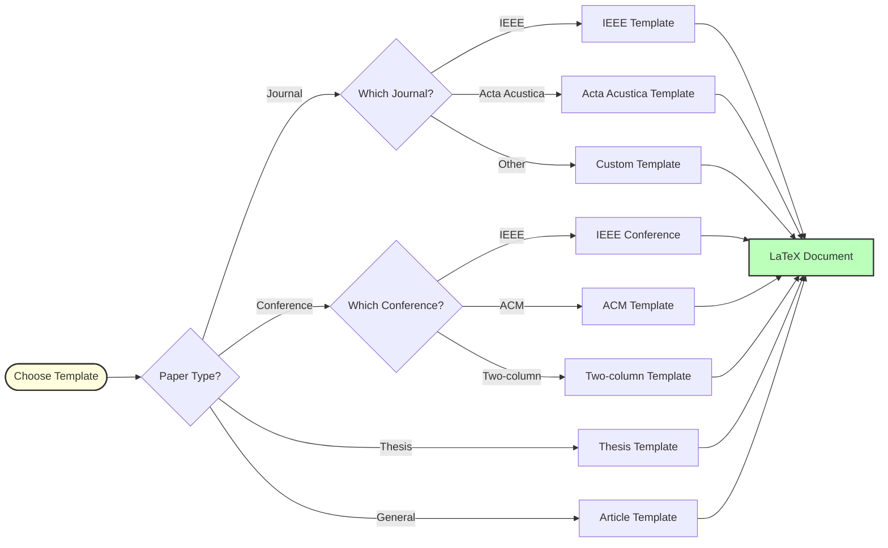
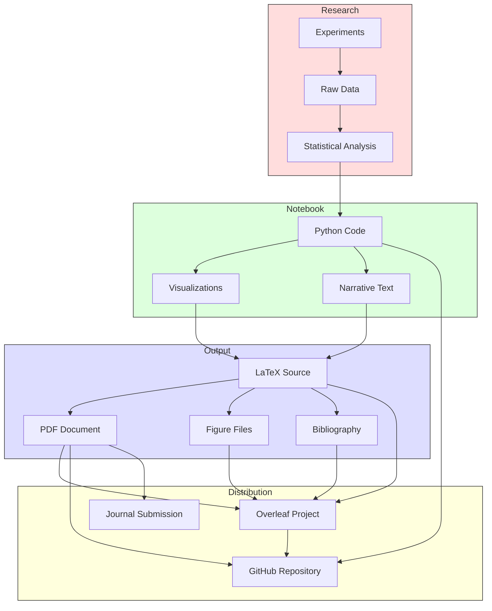
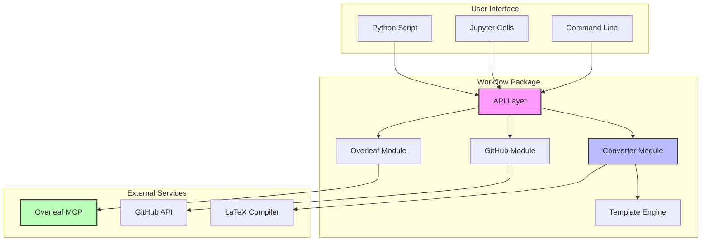
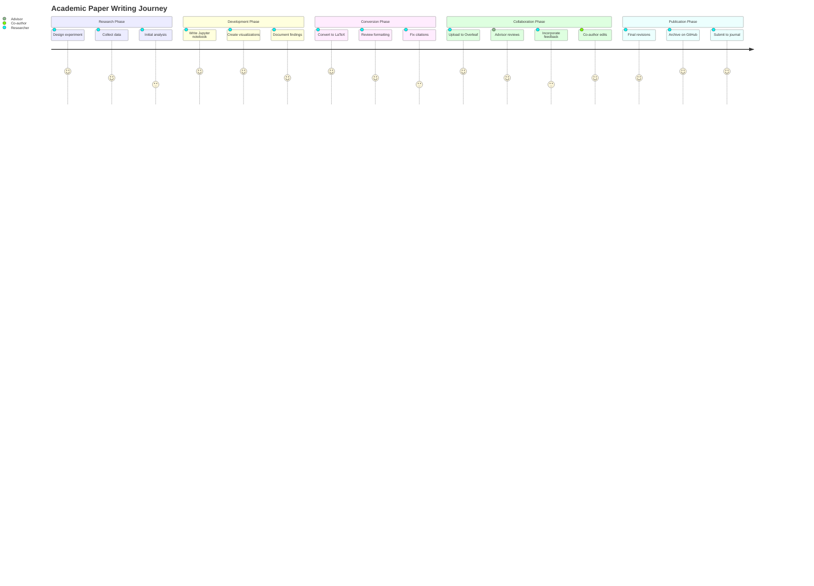
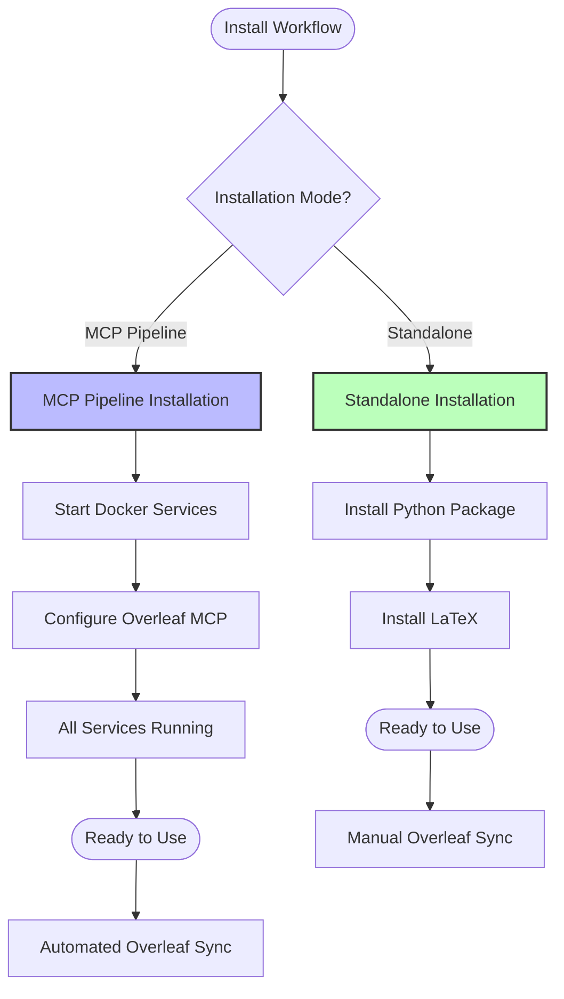

# Workflow Diagrams

Visual representations of the Jupyter-Overleaf workflow.

## Complete Workflow



## Notebook Structure



## Conversion Process



## Overleaf Integration



## GitHub Workflow



## Template Selection



## Data Flow



## Component Architecture



## User Journey



## Installation Options



---

## Using These Diagrams

These Mermaid diagrams can be:
- Rendered on GitHub (automatic in .md files)
- Used in documentation
- Exported to PNG/SVG with Mermaid CLI
- Embedded in presentations

To export as images:
```bash
npm install -g @mermaid-js/mermaid-cli
mmdc -i DIAGRAMS.md -o diagrams.pdf
```

---

This work was developed with assistance from Claude (Anthropic).
